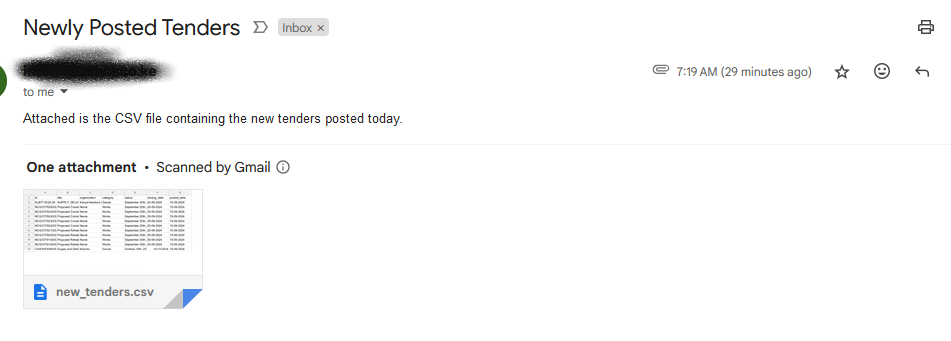
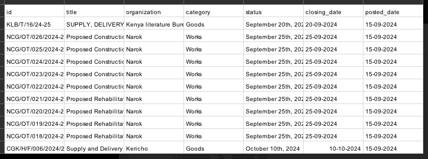
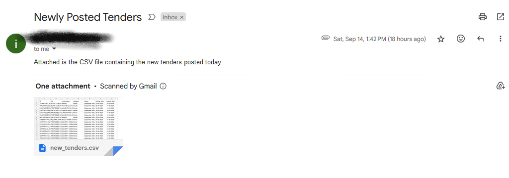
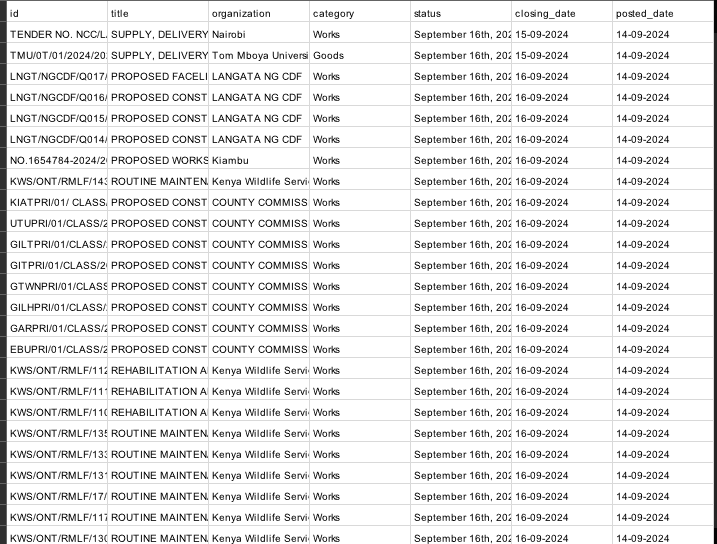

# Tender Scraping Automation

This Python script automates the process of scraping tender information from a government website, identifying new tenders, and sending email notifications with the results.

## Features

- Web scraping of tender information using Selenium and BeautifulSoup
- Parsing of various date formats
- CSV logging of scraped tenders
- Email notifications for new tenders
- Pagination handling for multi-page tender listings

## Requirements

- Python 3.x
- Chrome WebDriver
- Libraries: selenium, beautifulsoup4, smtplib

## Installation

1. Clone this repository or download the script.
2. Install required Python libraries:
   ```
   pip install selenium beautifulsoup4
   ```
3. Download and install Chrome WebDriver, ensuring it matches your Chrome version.

## Configuration

Before running the script, update the following variables in the script:

- `TENDER_URL`: URL of the tender website
- `SMTP_SERVER`: Your SMTP server address
- `SMTP_PORT`: SMTP port (default is 465 for SSL)
- `SENDER_EMAIL`: Email address to send notifications from
- `SENDER_PASSWORD`: Password for the sender email
- `RECIPIENT_EMAIL`: Email address to receive notifications
- Update the `executable_path` in the `scrape_tenders()` function to point to your Chrome WebDriver location

## Usage

Run the script using Python:

```
python Dailyupdate.py
```

The script will:
1. Scrape tender information from the specified website
2. Compare with previously scraped tenders
3. Save new tenders to a CSV file
4. Send an email with the new tenders as an attachment

## Output

- `tenders_log.csv`: Log of all scraped tenders
- `new_tenders.csv`: CSV file containing newly found tenders (created each run if new tenders are found)

## Customization

- Adjust the `time.sleep()` duration in the `scrape_tenders()` function if the website requires more time to load
- Modify the email subject and body in the `send_email_with_csv()` function as needed

## Final Results

Below is a screenshot showing the final results of the script running successfully:






## Security Note

Avoid hardcoding sensitive information like email passwords in the script. Consider using environment variables or a separate configuration file for such information.

## License

This project is licensed under the MIT License.

## Contributing

Contributions to improve the script are welcome. Please feel free to submit a pull request or open an issue.