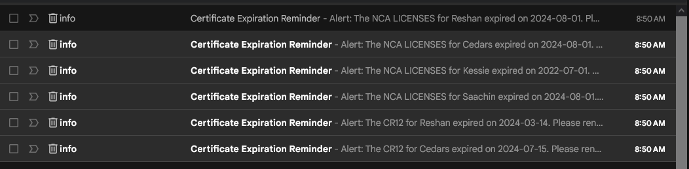
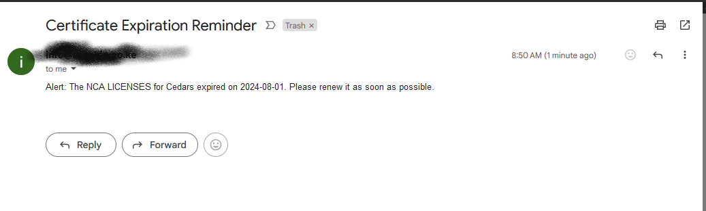

# License Automation Script

## Overview
This script automates the process of checking for certificate expirations and sending email reminders. It reads certificate data from a CSV file and sends alerts based on the expiration dates.

## Features
- Reads certificate information from `company_documents.csv`.
- Sends email reminders for certificates that are expiring soon or have already expired.
- Scheduled to run daily at 13:40.

## Requirements
- Python 3.x
- Required libraries:
  - `schedule`
  - `smtplib` (standard library)
  - `email` (standard library)
  - `csv` (standard library)
  - `datetime` (standard library)


Install the required libraries using:

```
pip install schedule
```
## Configuration
1. Update the email settings in the script:
   - `email_sender`: Your email address.
   - `email_recipient`: Recipient's email address.
   - `smtp_server`: Your SMTP server.
   - `smtp_username`: Your email address for SMTP authentication.
   - `smtp_password`: Your email password.

2. Ensure the `company_documents.csv` file is in the same directory as the script and contains the following columns:
   - Document
   - Company
   - Registration Date (format: dd/mm/yyyy)
   - Deadline Date (format: dd/mm/yyyy)

## Usage
Run the script using:
```
python script.py
```
The script will run continuously and check for certificate expirations at the scheduled time.

## Final Results

Below is a screenshot showing the final results of the script running successfully:





## License
This project is licensed under the MIT License.